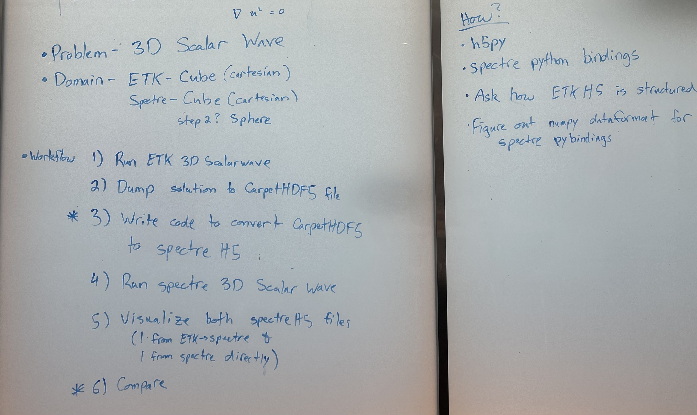

# nrcss2022_hackathon

Hackathon project at the Numerical Relativity Community Summer School 2022,
Providence, RI.

Collaborators:

* Cheng-Hsin Cheng
* Akshay Khadse
* Yoonsoo Kim
* Kyle Nelli (Principal Investigator)

Convert `CarpetHDF5` file generated from ETK code to a `H5` file that can be
read from SpECTRE analysis tools.

## To do

